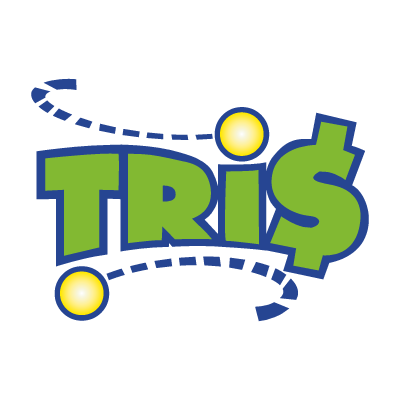

# Tris

Tris is a Java Swing desktop tic-tac-toe game with local graphical and audio assets, supporting two-player matches and play against a randomly moving bot.


## Overview

The application opens a fixed-size game window, presents an animated welcome and loading sequence, and then provides a main menu for selecting either a local 1-versus-1 match or a 1-versus-bot match. Game state is maintained in a 3×3 board, with visual symbols, turn timers, pause controls, win-line animations, draw handling, and a looping title sound.



## Features

- **Two game modes:** play locally against another player or against the built-in bot.
- **Turn management:** alternate X and O turns and automatically make a bot move when its timer expires.
- **Game resolution:** detect rows, columns, diagonals, and a full-board draw.
- **Desktop controls:** use the mouse for board and menu actions and `Enter` or `Esc` for the welcome and pause flows.
- **Presentation effects:** show a loading animation, countdowns, winning-line animations, X/O artwork, and title audio.

## Technology stack

- **Language:** Java 17
- **User interface:** Java Swing and AWT
- **Audio:** Java Sound API (`javax.sound.sampled`)
- **Project tooling:** Eclipse Java project configuration
- **Assets:** PNG images, an animated GIF, and a WAV sound file stored in the repository

## Architecture

The code uses a small separation of responsibilities rather than a formal framework:

- `src/Business` contains the application entry point and startup orchestration.
- `src/Bean` contains game state, player, bot, audio, and timer classes.
- `src/Graphics` contains the Swing frame, menus, board, symbols, loading screen, and win animations.
- `img`, `gif`, and `sound` contain the runtime media assets.

## Getting started

### Prerequisites

- Java Development Kit (JDK) 17. The Eclipse project configuration declares JavaSE-17 and Java compiler compliance/release 17.
- A graphical desktop environment capable of running Swing applications.

### Import and run with Eclipse

The repository includes Eclipse project metadata:

1. Import the repository as an existing Eclipse project.
2. Confirm that the project uses a Java 17 JRE.
3. Run `Business.Main` as a Java application from the project root.

The application expects the `img`, `gif`, and `sound` directories to remain available relative to its working directory.

### Compile from the command line

The source can be compiled without third-party dependencies:

```bash
mkdir -p /tmp/tris-classes
javac -encoding ISO-8859-1 -d /tmp/tris-classes $(find src -name '*.java')
```

The compiled entry point is `Business.Main`. Runtime media paths in the source use Windows-style backslashes, so command-line execution may require a Windows working environment or source-level path adjustments on other operating systems.

## Project structure

```text
.
├── .classpath
├── .project
├── .settings/
├── gif/
├── img/
├── sound/
└── src/
    ├── Bean/
    ├── Business/
    └── Graphics/
```

## Testing

No automated tests are included in the repository. The verified validation available from the current project is Java compilation with the command shown above; interactive game behavior requires a graphical runtime.

## Project status

This repository contains a standalone desktop game implementation. No build automation, dependency manager, continuous-integration workflow, deployment configuration, or release metadata is included.

## Licensing

No license file or explicit license declaration is present in the repository. Licensing status requires human review.
